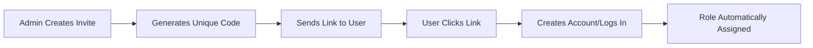

# Role Management

This page covers how to assign, manage, and audit user roles within Conducky's RBAC system.

## 🎯 Role Assignment Methods

### 1. Invite Links (Recommended)

The most common method for assigning roles is through invite links:



**Benefits:**
- Secure and time-limited
- Can include custom welcome messages
- Tracks who sent the invite
- Automatically assigns correct role upon signup

### 2. Direct Assignment

Admins can directly assign roles to existing users:

- **System Admins** can assign any role at any scope
- **Organization Admins** can assign organization and event roles
- **Event Admins** can assign event-level roles only

### 3. Organization Inheritance

Organization roles automatically grant event permissions:
- **Organization Admin** → **Event Admin** for all org events
- **Organization Viewer** → No automatic event permissions

## 🔗 Creating Invite Links

### Event Invite Links

**Who can create:** Event Admins, Organization Admins (for org events), System Admins

**Steps:**
1. Navigate to event settings
2. Go to "Team Management" section
3. Click "Create Invite Link"
4. Select role (Responder, Event Admin)
5. Set expiration (optional)
6. Add note/message (optional)
7. Copy and share the generated link

**Example invite link:**
```
https://yourdomain.com/invite/abc123def456
```

### Organization Invite Links

**Who can create:** Organization Admins, System Admins

**Steps:**
1. Navigate to organization settings
2. Go to "Members" section  
3. Click "Create Invite Link"
4. Select role (Organization Admin, Organization Viewer)
5. Configure invite settings
6. Share with intended recipient

### System Admin Assignment

**Who can create:** System Admins only

System Admin roles cannot be assigned via invite links and must be directly assigned through:
- Database management
- System configuration
- Direct API calls with system admin credentials

## 👥 Managing Team Members

### Viewing Current Roles

**Event Level:**
- Navigate to `/events/[event-slug]/team`
- View all team members and their roles
- See when roles were assigned and by whom

**Organization Level:**
- Navigate to `/orgs/[org-slug]/team`
- View organization members across all events
- See role inheritance patterns

**System Level:**
- Navigate to `/admin/users` (System Admins only)
- View all users and their system-level roles
- Audit cross-organization access

### Modifying Existing Roles

**Promoting Users:**
```
Reporter → Responder → Event Admin
Organization Viewer → Organization Admin
(No automatic promotion to System Admin)
```

**Role Changes:**
- Event Admins can promote/demote within their events
- Organization Admins can modify org and event roles
- System Admins can modify any role

**Removing Access:**
- Roles can be revoked at any time
- Users lose access immediately upon role removal
- Audit logs track all role changes

## 📊 Role Audit and Monitoring

### Audit Logging

All role changes are automatically logged:

```json
{
  "action": "role_assigned",
  "userId": "user-123",
  "targetRole": "responder", 
  "scope": "event",
  "scopeId": "event-456",
  "assignedBy": "admin-789",
  "timestamp": "2024-01-15T10:30:00Z"
}
```

### Regular Role Reviews

**Monthly Reviews:**
- Review active user roles
- Remove inactive users
- Audit cross-event access patterns
- Verify role assignments match current needs

**Event Lifecycle Reviews:**
- Remove event roles when events end
- Archive or transfer ownership as needed
- Clean up expired invite links

### Access Pattern Monitoring

Monitor for unusual access patterns:
- Users with roles across many events
- Inactive users with elevated privileges  
- Failed permission attempts
- Unusual login patterns

## 🔄 Role Transition Workflows

### New Event Setup

1. **System Admin** creates event
2. **System Admin** creates admin invite link
3. **Event Organizer** accepts invite → becomes **Event Admin**
4. **Event Admin** invites response team → become **Responders**
5. **Event goes live** → **Reporters** can submit incidents

### Organization Onboarding  

1. **System Admin** creates organization
2. **System Admin** assigns **Organization Admin** role
3. **Organization Admin** creates events within organization
4. **Organization Admin** automatically becomes **Event Admin** for org events
5. **Organization Admin** invites team members as needed

### Event Conclusion

1. **Event Admin** reviews final incident status
2. **Event Admin** exports data if needed
3. **Organization Admin** or **System Admin** deactivates event
4. **Event roles** are archived but preserved for audit
5. **Organization roles** remain active for future events

## 🚨 Role Management Best Practices

### Security Guidelines

**Principle of Least Privilege:**
- Assign minimum necessary permissions
- Regularly review and remove unused roles
- Use time-limited invite links when possible

**Role Separation:**
- Don't assign System Admin roles unnecessarily
- Keep organization and event roles separate when appropriate
- Monitor cross-event access patterns

**Regular Auditing:**
- Monthly role reviews
- Quarterly access pattern analysis
- Annual comprehensive security audit

### Operational Guidelines

**Documentation:**
- Document why specific roles were assigned
- Keep records of role change justifications
- Maintain contact information for role holders

**Communication:**
- Notify users when roles are assigned or changed
- Provide clear instructions for new team members
- Set expectations for role responsibilities

**Backup Planning:**
- Ensure multiple people have admin access to critical events
- Plan for admin succession
- Document emergency access procedures

## 🛠️ Troubleshooting Role Issues

### Common Problems

**User Can't Access Event:**
1. Verify user has appropriate event role
2. Check if event is active
3. Confirm user account is verified
4. Review event-specific permissions

**Invite Link Not Working:**
1. Check if link has expired
2. Verify link hasn't reached usage limit
3. Confirm event/organization is still active
4. Check for typos in the link

**Permission Denied Errors:**
1. Verify user role matches required permissions
2. Check if role assignment is active
3. Confirm user is logged into correct account
4. Review recent role changes in audit log

### Getting Help

**For Users:**
1. Contact your event administrator
2. Check notification center for role updates
3. Review the [user guide](../../user-guide/authentication) for account issues

**For Administrators:**
1. Check audit logs for recent changes
2. Review system admin documentation
3. Contact system administrator for escalation

<!-- Screenshot Placeholder -->
> **Screenshot needed**: Role management interface showing team member assignments and invite link creation 