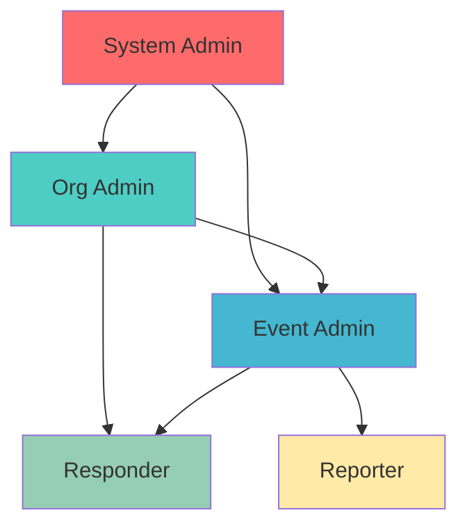

# RBAC Overview

Conducky implements a sophisticated Role-Based Access Control (RBAC) system that operates across multiple scopes to ensure users have appropriate access to functionality and data.

## 🏗️ Three-Scope Permission Model

Conducky's RBAC system operates at three distinct levels:

- **System Level**: Overall platform administration
- **Organization Level**: Multi-event entity management  
- **Event Level**: Individual event and incident management

## 🎯 Core Principles

### Principle of Least Privilege
Users receive only the minimum permissions necessary to perform their role. Even System Admins cannot access event incident data without explicit event-level permissions.

### Scope Isolation
Data and permissions are strictly isolated by scope:
- Organization data is only accessible to organization members
- Event data is only accessible to event team members
- System data is only accessible to system administrators

### Role Inheritance
Higher-level roles automatically inherit permissions from lower-level roles within their scope, but not across scopes.

## 📋 Quick Role Reference

| Role | Primary Function | Access Level |
|------|-----------------|--------------|
| **System Admin** | Platform management | System-wide settings, no automatic event access |
| **Org Admin** | Organization oversight | All events in organization |
| **Org Viewer** | Organization visibility | Read-only organization info |
| **Event Admin** | Event management | Full event control |
| **Responder** | Incident handling | All incidents in assigned events |
| **Reporter** | Report submission | Own reports only |

## 🔍 What's Next?

- **[Role Definitions](./roles)** - Detailed breakdown of each role's capabilities
- **[Permission Enforcement](./enforcement)** - How access control is implemented
- **[Role Management](./management)** - Assigning and managing user roles
- **Security Best Practices** - Recommendations for secure RBAC usage

<!-- Screenshot Placeholder -->
> **Screenshot needed**: RBAC dashboard showing role hierarchy and assignments 