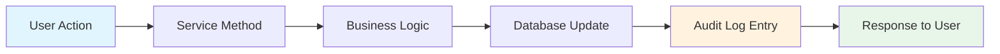

# Audit Logging and System Monitoring

Conducky maintains comprehensive audit logs to track all significant actions within the system. This provides accountability, security monitoring, and compliance support for incident management operations.

## Audit System Overview

### Purpose and Benefits
- **Accountability**: Track who performed what actions and when
- **Security Monitoring**: Detect unauthorized access or suspicious activity
- **Compliance**: Support regulatory requirements and internal policies
- **Incident Investigation**: Provide detailed history for incident resolution
- **System Debugging**: Help troubleshoot issues with detailed action history

### Audit Log Structure
Each audit log entry contains:
- **Action**: What was performed (e.g., "create_incident", "assign_user")
- **Target Type**: Type of entity affected (e.g., "incident", "user", "event")
- **Target ID**: Unique identifier of the affected entity
- **User ID**: Who performed the action (null for system actions)
- **Timestamp**: When the action occurred
- **Event/Organization Context**: Scope of the action for multi-tenancy
- **IP Address**: Source IP of the request (when available)
- **User Agent**: Browser/client information (when available)

## Tracked Events

### Incident Management Events

#### Incident Lifecycle
| Action | Description | Target Type | Logged Information |
|--------|-------------|-------------|-------------------|
| `create_incident` | New incident reported | `incident` | Reporter ID, event context |
| `update_incident_title` | Incident title changed | `incident` | User ID, old/new values |
| `update_incident_description` | Description modified | `incident` | User ID, modification timestamp |
| `update_incident_severity` | Severity level changed | `incident` | User ID, old/new severity |
| `update_incident_state` | Report state changed | `incident` | New state, notes |
| `assign_incident` | Report assigned to responder | `incident` | Responder ID |
| `resolve_incident` | Incident marked as resolved | `incident` | Resolver ID, resolution details |
| `close_incident` | Incident closed | `incident` | User ID, closure reason |

#### Incident Comments
| Action | Description | Target Type | Logged Information |
|--------|-------------|-------------|-------------------|
| `create_comment` | Comment added to incident | `comment` | Author ID, visibility (internal/external) |
| `update_comment` | Comment content modified | `comment` | Editor ID, modification timestamp |
| `delete_comment` | Comment removed | `comment` | Deleter ID, deletion reason |

#### Related File Management

| Action | Description | Target | Details |
| :--- | :--- | :--- | :--- |
| `upload_related_file` | File uploaded to incident | `RelatedFile` | Uploader ID, file metadata |
| `download_related_file` | Related file accessed | `RelatedFile` | Accessor ID, access timestamp |
| `delete_related_file` | Related file removed | `RelatedFile` | Deleter ID, deletion reason |

### User and Access Management

#### Authentication Events
| Action | Description | Target Type | Logged Information |
|--------|-------------|-------------|-------------------|
| `user_login_success` | Successful login | `user` | Login method, IP address |
| `user_login_failed` | Failed login attempt | `user` | Attempted email, IP address, failure reason |
| `user_logout` | User logged out | `user` | Session duration |
| `password_reset_requested` | Password reset initiated | `user` | Request timestamp, IP address |
| `password_reset_completed` | Password successfully reset | `user` | Reset timestamp |

#### Role Management
| Action | Description | Target Type | Logged Information |
|--------|-------------|-------------|-------------------|
| `grant_role` | Role assigned to user | `user_role` | Granter ID, role type, scope |
| `revoke_role` | Role removed from user | `user_role` | Revoker ID, role type, scope |
| `role_inherited` | Role inherited from organization | `user_role` | Inheritance source |

### Event and Organization Management

#### Event Operations
| Action | Description | Target Type | Logged Information |
|--------|-------------|-------------|-------------------|
| `create_event` | New event created | `event` | Creator ID, organization context |
| `update_event` | Event details modified | `event` | Editor ID, changed fields |
| `activate_event` | Event activated | `event` | Activator ID |
| `deactivate_event` | Event deactivated | `event` | Deactivator ID, reason |

#### Organization Operations
| Action | Description | Target Type | Logged Information |
|--------|-------------|-------------|-------------------|
| `create_organization` | New organization created | `organization` | Creator ID |
| `update_organization` | Organization details modified | `organization` | Editor ID, changed fields |
| `add_organization_member` | User added to organization | `organization` | Adder ID, new member ID, role |
| `remove_organization_member` | User removed from organization | `organization` | Remover ID, removed member ID |

### Invitation Management
| Action | Description | Target Type | Logged Information |
|--------|-------------|-------------|-------------------|
| `create_invite` | Invitation link created | `invite` | Creator ID, target role, expiration |
| `redeem_invite` | Invitation used | `invite` | Redeemer ID, assigned role |
| `expire_invite` | Invitation expired | `invite` | Expiration timestamp |
| `revoke_invite` | Invitation manually revoked | `invite` | Revoker ID, revocation reason |

### System Administration
| Action | Description | Target Type | Logged Information |
|--------|-------------|-------------|-------------------|
| `update_system_settings` | System configuration changed | `system_setting` | Admin ID, setting key, change type |
| `database_migration` | Database schema updated | `system` | Migration version, execution time |
| `security_scan` | Security audit performed | `system` | Scan type, findings summary |

## Audit Log Access and Viewing

### Access Control
Audit log access is strictly controlled based on user roles:

#### Event-Level Audit Logs
- **Event Admins**: Can view all audit logs for their events
- **Responders**: Can view audit logs for incidents they're involved with
- **Reporters**: Cannot access audit logs directly

#### Organization-Level Audit Logs
- **Organization Admins**: Can view all audit logs for their organization and its events
- **Organization Viewers**: Can view limited audit logs (non-sensitive actions)

#### System-Level Audit Logs
- **System Admins**: Can view all audit logs across the entire system
- **Regular Users**: Cannot access system-level audit logs

### Audit Log Viewing Interfaces

#### Web Interface
- **Event Audit Page**: `/events/{eventSlug}/audit`
- **Organization Audit Page**: `/orgs/{orgSlug}/audit`
- **System Audit Page**: `/admin/system/audit`

#### API Endpoints
- **Event Audit API**: `GET /api/audit/events/{eventId}/audit`
- **Organization Audit API**: `GET /api/audit/organizations/{organizationId}/audit`
- **System Audit API**: `GET /api/audit/system/audit`

### Filtering and Search
All audit log interfaces support:
- **Time Range Filtering**: Filter by date/time ranges
- **Action Type Filtering**: Filter by specific action types
- **User Filtering**: Filter by specific users
- **Target Type Filtering**: Filter by entity types (incident, user, etc.)
- **Text Search**: Search within action descriptions
- **Sorting**: Sort by timestamp, action, user, or target type

## Audit Log Implementation

### Automatic Logging
Audit logging is integrated into the service layer:

### Audit Log Storage
- **Database Table**: `AuditLog` table in PostgreSQL
- **Encryption**: Audit logs are encrypted at rest

### Performance Considerations
- **Asynchronous Logging**: Audit logs are written asynchronously to avoid performance impact
- **Batch Processing**: Multiple audit entries can be batched for efficiency
- **Indexing**: Database indexes optimize audit log queries
- **Pagination**: Large audit log results are paginated

## Security and Compliance

### Audit Log Security
- **Immutable Records**: Audit logs cannot be modified after creation
- **Integrity Verification**: Checksums ensure audit log integrity
- **Access Monitoring**: Access to audit logs is itself audited
- **Encryption**: All audit data is encrypted at rest and in transit

## Monitoring and Alerting

### Audit Log Monitoring
- **Failed Audit Writes**: Alert when audit logging fails
- **Suspicious Patterns**: Detect unusual access patterns
- **Privilege Escalation**: Monitor for unauthorized role changes
- **Data Access Anomalies**: Unusual data access patterns

### Security Alerts
- **Multiple Failed Logins**: Potential brute force attacks
- **Privilege Changes**: Unauthorized role modifications
- **Mass Data Access**: Bulk data downloads or access
- **After-Hours Activity**: Unusual activity outside business hours

### Dashboard Metrics
- **Audit Volume**: Number of audit events over time
- **User Activity**: Most active users and action types
- **Error Rates**: Failed actions and error patterns
- **Compliance Status**: Current compliance posture

## Audit Log Analysis

### Common Analysis Patterns

#### Incident Investigation
1. **Timeline Reconstruction**: Build complete timeline of incident handling
2. **Access Tracking**: Who accessed sensitive incident data
3. **Decision Audit**: Track decision points and rationale
4. **Communication Analysis**: Review comment and notification patterns

#### Security Analysis
1. **Access Pattern Analysis**: Identify unusual access patterns
2. **Privilege Escalation Detection**: Monitor for unauthorized role changes
3. **Data Exfiltration Detection**: Track large data downloads or exports
4. **Account Compromise Indicators**: Unusual login patterns or activities

#### Performance Analysis
1. **User Workflow Optimization**: Identify bottlenecks in user workflows
2. **System Usage Patterns**: Understand how the system is being used
3. **Feature Adoption**: Track adoption of new features
4. **Error Pattern Analysis**: Identify common user errors or system issues

### Audit Analytics Tools
- **Built-in Dashboards**: Pre-configured analytics dashboards
- **Custom Queries**: SQL-based audit log analysis
- **Export Integration**: Integration with external analytics tools
- **API Access**: Programmatic access to audit data for custom analysis

## Troubleshooting and Maintenance

### Common Issues

#### Missing Audit Logs
- **Service Integration**: Verify audit logging is integrated in all service methods
- **Database Connectivity**: Check database connection for audit writes
- **Async Processing**: Ensure asynchronous audit processing is working

#### Performance Issues
- **Database Indexing**: Verify audit log table indexes are optimized
- **Query Optimization**: Optimize slow audit log queries
- **Archival Process**: Ensure old logs are being archived properly

#### Access Issues
- **Permission Configuration**: Verify role-based access to audit logs
- **API Authentication**: Check API authentication for audit endpoints
- **UI Integration**: Ensure audit log UI is properly integrated

### Maintenance Tasks
- **Regular Archival**: Archive old audit logs to long-term storage
- **Index Optimization**: Maintain database indexes for performance
- **Retention Policy**: Enforce audit log retention policies
- **Backup Verification**: Verify audit log backups are working

## Screenshots Needed

The following screenshots would enhance this documentation:

1. **Event audit log page** - Main audit log interface for events
2. **Audit log filtering** - How to filter and search audit logs
3. **System audit dashboard** - System-wide audit log overview
4. **Audit log details** - Detailed view of individual audit entries
5. **Compliance report** - Example of generated compliance report
6. **Audit analytics dashboard** - Metrics and analysis of audit data
7. **Mobile audit view** - How audit logs appear on mobile devices
8. **Audit log export** - Exporting audit data for external analysis 