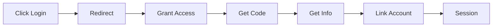
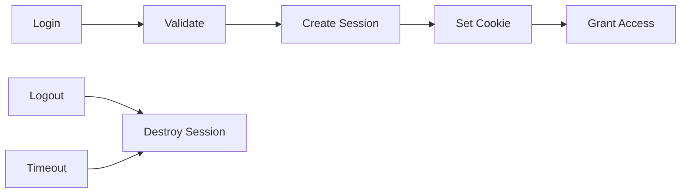
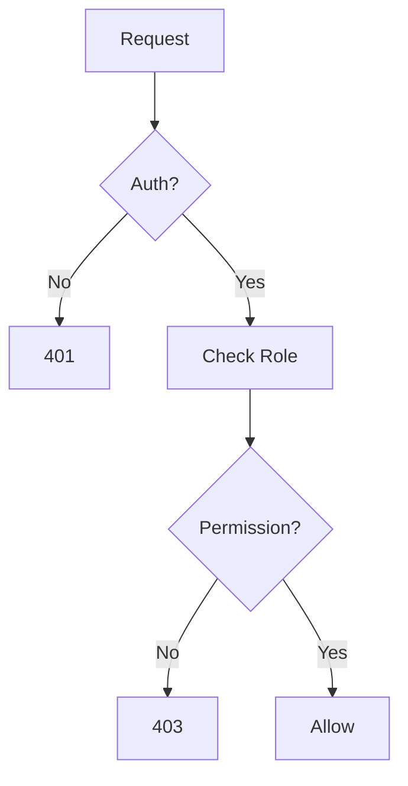

# Authentication & Authorization

Conducky implements a robust authentication system with multiple login methods and secure session management to protect user accounts and maintain system security.

## 🔐 Authentication Methods

### 1. Email/Password Authentication

**Standard login flow:**
- User provides email address and password
- Server validates credentials against hashed passwords
- Secure session is established upon successful authentication

**Security features:**
- **Password hashing**: Using bcrypt with salt for secure storage
- **Rate limiting**: Protection against brute force attacks
- **Account lockout**: Temporary lockout after failed attempts

<!-- Screenshot Placeholder -->
> **Screenshot needed**: Standard login form with security features highlighted

### 2. Social Authentication

Conducky supports OAuth integration with major providers:

#### Google OAuth 2.0
- **Scopes requested**: Email and basic profile information
- **Data collected**: Email address, name, profile picture
- **Account linking**: Can link multiple Google accounts to one Conducky account

#### GitHub OAuth
- **Scopes requested**: User email and public profile
- **Data collected**: Email address, username, avatar
- **Organization integration**: Respects GitHub organization membership when configured



### 3. Invite-Based Registration

**For new users joining through invitations:**
- Event administrators generate secure invite links
- Users click link and are prompted to create account
- Account is automatically associated with the invited event and role
- Immediate access to event functionality upon completion

## 🔑 Session Management

### Session Security

**Session Configuration:**
- **Secure cookies**: HTTPS-only in production
- **HttpOnly flags**: Prevents client-side script access
- **SameSite protection**: CSRF attack prevention
- **Session expiration**: Configurable timeout periods

**Session Storage:**
- **Server-side sessions**: Session data stored on server, not in cookies
- **Session rotation**: New session ID generated on login
- **Secure logout**: Complete session destruction on logout

### Session Lifecycle



## 🛡️ Security Features

### Password Security

**Requirements:**
- Minimum 8 characters
- Must include letters, numbers, and symbols
- Cannot be common passwords (dictionary check)
- Cannot reuse last 3 passwords

**Protection Measures:**
- **Bcrypt hashing**: Industry-standard password hashing
- **Salt generation**: Unique salt per password
- **Hash verification**: Secure password comparison
- **Password reset**: Secure token-based reset process

### Multi-Factor Authentication (MFA)

**Status**: Coming soon

Multi-factor authentication support is planned for a future release. Currently, account security relies on:
- Strong password requirements
- Session management with secure cookies
- Account lockout protection
- Login attempt monitoring

<!-- Screenshot Placeholder -->
> **Screenshot needed**: MFA setup interface with QR code and backup codes (future feature)

### Account Security Monitoring

**Automated Monitoring:**
- **Login anomaly detection**: Unusual login patterns
- **Geographic anomalies**: Logins from new locations
- **Device fingerprinting**: Track login devices
- **Session monitoring**: Multiple concurrent sessions

**Security Alerts:**
- **Email notifications**: For suspicious login attempts
- **Admin alerts**: For repeated failed attempts
- **Account lockout**: Automatic protection mechanisms
- **Audit logging**: All authentication events logged

## 🔒 Authorization Flow

### Request Authorization Process



### Permission Checking

**API Level:**
```typescript
// Example: Checking event access
const hasEventAccess = await checkEventPermission(
  userId, 
  eventId, 
  ['responder', 'event_admin']
);
```

**UI Level:**
```typescript
// Example: Conditional rendering
{hasRole('event_admin') && (
  <AdminPanel />
)}
```

## 🚨 Security Incidents & Response

### Failed Authentication Handling

**Rate Limiting:**
- **Progressive delays**: Increasing delays after failed attempts
- **IP-based limiting**: Temporary blocks for suspicious IPs
- **Account protection**: Lock accounts after repeated failures

**Incident Response:**
- **Automatic logging**: All failed attempts logged with details
- **Admin notifications**: Alerts for unusual patterns
- **Forensic data**: IP addresses, user agents, timestamps
- **Account recovery**: Secure process for locked accounts

### Suspicious Activity Detection

**Monitored Patterns:**
- **Brute force attempts**: Rapid password guessing
- **Credential stuffing**: Use of breached password lists
- **Session hijacking**: Unusual session characteristics
- **Privilege escalation**: Attempts to gain unauthorized access

**Response Actions:**
- **Immediate blocking**: Real-time threat prevention
- **Account notification**: Email alerts to account owners
- **Enhanced logging**: Detailed forensic information
- **Manual review**: Security team investigation for serious threats

## 🔧 Authentication Configuration

### For System Administrators

**OAuth Setup:**
1. **Configure providers** in System Settings
2. **Set callback URLs** for your domain
3. **Test integration** with development accounts
4. **Monitor usage** through admin dashboards

**Security Settings:**
- **Session timeout**: Configure expiration periods
- **Password policies**: Set complexity requirements
- **MFA enforcement**: Require for admin accounts
- **Rate limiting**: Adjust thresholds for your environment

<!-- Screenshot Placeholder -->
> **Screenshot needed**: System admin OAuth configuration interface

### For Users

**Account Security:**
1. **Use strong passwords**: Follow security guidelines
2. **Enable MFA**: Add extra protection to your account
3. **Monitor sessions**: Review active sessions regularly
4. **Secure logout**: Always log out on shared devices

**Best Practices:**
- **Unique passwords**: Don't reuse passwords from other sites
- **Regular updates**: Change passwords periodically
- **Secure devices**: Keep devices updated and secure
- **Report issues**: Contact administrators about suspicious activity

## 📊 Authentication Metrics

### Security Monitoring Dashboard

**Key Metrics:**
- **Login success/failure rates**
- **Geographic distribution of logins**
- **Authentication method usage**
- **Session duration statistics**
- **Failed attempt patterns**

**Audit Reports:**
- **Daily authentication summary**
- **Weekly security incidents**
- **Monthly access pattern analysis**
- **Quarterly security review**

<!-- Screenshot Placeholder -->
> **Screenshot needed**: Authentication metrics dashboard

## 🛠️ Troubleshooting Authentication

### Common Issues

**Cannot Login:**
1. **Check credentials**: Verify email/password accuracy
2. **Account status**: Confirm account is active
3. **Browser issues**: Clear cookies and cache
4. **Network problems**: Check firewall and connectivity

**Social Login Problems:**
1. **OAuth configuration**: Verify provider settings
2. **Email conflicts**: Check for account linking issues
3. **Permission errors**: Confirm OAuth scopes
4. **Browser blocking**: Disable popup blockers

**Session Problems:**
1. **Cookie settings**: Enable cookies for the site
2. **HTTPS issues**: Ensure secure connection
3. **Clock synchronization**: Check system time accuracy
4. **Multiple tabs**: Close other sessions

### Getting Help

**User Support:**
- **Password reset**: Use "Forgot Password" feature
- **Account recovery**: Contact event administrators
- **Technical issues**: Report to system administrators

**Administrative Support:**
- **User account issues**: Use admin user management
- **System problems**: Check authentication logs
- **Security incidents**: Follow incident response procedures

---

## Related Documentation

- **[Security Overview](./overview.md)** - General security principles
- **[Access Control](./access-control/overview)** - Role-based permissions
- **Data Protection** - Data security measures (coming soon)
- **[Admin Guide: System Configuration](../admin-guide/system-configuration.md)** - Authentication setup 