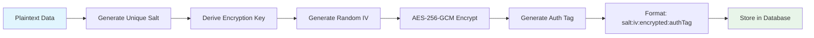
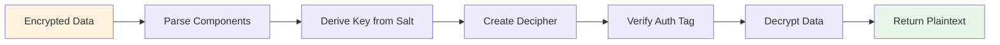

# Data Protection and Encryption

Conducky implements comprehensive data protection measures to safeguard sensitive information throughout the incident management process. This includes field-level encryption, secure key management, and privacy controls.

## Encryption Overview

### Field-Level Encryption
Conducky uses **AES-256-GCM encryption** with unique salts for each field to protect sensitive data at rest. This approach provides:

- **Confidentiality**: Sensitive data is unreadable without the encryption key
- **Integrity**: Data tampering is detectable through authentication tags
- **Unique Protection**: Each field uses a unique salt to prevent rainbow table attacks

### Encryption Algorithm Details
- **Algorithm**: AES-256-GCM (Galois/Counter Mode)
- **Key Size**: 256 bits (32 bytes)
- **IV Length**: 16 bytes (required for GCM mode)
- **Salt Length**: 32 bytes (unique per encryption operation)
- **Key Derivation**: PBKDF2 with SHA-512, 100,000 iterations

## Encrypted Data Fields

### Incident Data
The following incident fields are automatically encrypted before storage:

| Field | Description | Encryption Status |
|-------|-------------|-------------------|
| `description` | Full incident description | ✅ Encrypted |
| `parties` | Names/details of involved parties | ✅ Encrypted |
| `location` | Where the incident occurred | ✅ Encrypted |
| `title` | Incident title | ❌ Not encrypted (used for searching) |
| `state` | Incident status | ❌ Not encrypted (used for filtering) |
| `severity` | Incident severity level | ❌ Not encrypted (used for filtering) |

### Comment Data
All comment content is encrypted to protect sensitive discussions:

| Field | Description | Encryption Status |
|-------|-------------|-------------------|
| `body` | Comment text content | ✅ Encrypted |
| `visibility` | Internal/External flag | ❌ Not encrypted (used for access control) |
| `authorId` | Comment author | ❌ Not encrypted (used for permissions) |

### Event Data
Event contact information is protected:

| Field | Description | Encryption Status |
|-------|-------------|-------------------|
| `contactEmail` | Event contact email | ✅ Encrypted |
| `name` | Event name | ❌ Not encrypted (public information) |
| `description` | Event description | ❌ Not encrypted (public information) |

### System Settings
Sensitive configuration data is encrypted:

| Setting Type | Encrypted Fields |
|--------------|------------------|
| Email Configuration | SMTP passwords, API keys |
| OAuth Configuration | Client secrets for Google/GitHub |
| System Credentials | Any sensitive authentication tokens |

## Encryption Implementation

### Encryption Process



**Encryption Format**: `salt:iv:encrypted:authTag` (all components hex-encoded)

### Decryption Process



### Key Management

#### Environment Variables
- **`ENCRYPTION_KEY`**: Master encryption key (required, minimum 32 characters)
- **Key Validation**: Automatic validation on application startup
- **Production Requirements**: Must not contain development-related terms

#### Key Derivation
Each encryption operation uses PBKDF2 to derive a unique encryption key:
- **Master Key**: From `ENCRYPTION_KEY` environment variable
- **Unique Salt**: 32 random bytes per encryption operation
- **Iterations**: 100,000 (PBKDF2 with SHA-512)
- **Output**: 32-byte derived key for AES-256

#### Key Security Features
- **Weak Key Detection**: Prevents use of common weak keys
- **Environment Validation**: Different requirements for development vs production
- **Startup Validation**: Application fails to start with invalid encryption keys

## Data Protection Features

### Automatic Encryption
- **Service Layer Integration**: Encryption happens automatically in service methods
- **Transparent Operation**: Application code works with plaintext, encryption is handled internally
- **Error Handling**: Graceful degradation if decryption fails

### Backward Compatibility
The system supports both legacy and new encryption formats:
- **Legacy Format**: `iv:encrypted:authTag` (fixed salt, less secure)
- **New Format**: `salt:iv:encrypted:authTag` (unique salt, more secure)
- **Migration Scripts**: Available to upgrade legacy encrypted data

### Access Control Integration
Encryption works seamlessly with role-based access control:
- **Permission Checks**: Performed before decryption
- **Selective Decryption**: Only authorized users see decrypted content
- **Audit Logging**: All access to encrypted data is logged

## Privacy Controls

### Comment Visibility
Comments have built-in privacy controls:
- **Internal Comments**: Visible only to response team members
- **External Comments**: Visible to reporters and response team
- **Encryption**: All comment content is encrypted regardless of visibility

### Incident Reporter Privacy
- **Contact Information**: Reporter details are protected
- **Anonymous Reporting**: System supports anonymous incident submission
- **Data Minimization**: Only necessary information is collected and stored

### Evidence Protection
Uploaded evidence files receive additional protection:
- **File Encryption**: Evidence files are encrypted on disk
- **Access Logging**: All evidence access is audited
- **Retention Controls**: Automatic cleanup based on retention policies

## Migration and Maintenance

### Encryption Migration Scripts

#### Phase 1: Incident and Comment Encryption
```bash
# Dry run to see what would be encrypted
node scripts/migrate-phase1-encryption.js --dry-run

# Apply encryption to existing data
node scripts/migrate-phase1-encryption.js
```

#### Phase 2: Event Contact Encryption
```bash
# Encrypt event contact emails
node scripts/migrate-phase2-encryption.js --dry-run
node scripts/migrate-phase2-encryption.js
```

#### Security Enhancement Migration
```bash
# Upgrade legacy encryption to use unique salts
node scripts/migrate-encryption-security.js --dry-run
node scripts/migrate-encryption-security.js
```

### Validation and Testing
Each migration script includes:
- **Dry Run Mode**: Preview changes without applying them
- **Validation**: Verify encryption was successful
- **Rollback Capability**: Safe recovery if issues occur
- **Progress Reporting**: Detailed logs of migration progress

## Security Best Practices

### Deployment Security
1. **Encryption Key Management**:
   - Use a strong, unique encryption key for each environment
   - Store encryption keys securely (environment variables, key vaults)
   - Never commit encryption keys to version control
   - Rotate encryption keys periodically (requires data re-encryption)

2. **Database Security**:
   - Enable database encryption at rest
   - Use encrypted connections (SSL/TLS) for database communication
   - Implement database access controls and monitoring

3. **Application Security**:
   - Regular security audits of encryption implementation
   - Monitor for encryption/decryption errors
   - Implement proper error handling to prevent information leakage

### Monitoring and Alerting
- **Encryption Failures**: Alert on decryption errors or encryption key issues
- **Performance Monitoring**: Track encryption/decryption performance impact
- **Access Auditing**: Log all access to sensitive encrypted data

## Performance Considerations

### Encryption Overhead
- **CPU Impact**: AES-256-GCM is optimized for modern processors
- **Storage Impact**: Encrypted data is approximately 30% larger than plaintext
- **Memory Usage**: Minimal additional memory required for encryption operations

### Optimization Strategies
- **Lazy Decryption**: Data is only decrypted when accessed by authorized users
- **Caching**: Decrypted data can be cached temporarily for performance
- **Batch Operations**: Bulk encryption/decryption for large datasets

### Scalability
- **Stateless Design**: Encryption operations are stateless and horizontally scalable
- **Database Indexes**: Encrypted fields cannot be indexed, but metadata fields can be
- **Query Optimization**: Use non-encrypted fields for filtering and sorting

## Compliance and Standards

### Encryption Standards
- **FIPS 140-2**: AES-256 algorithm meets FIPS 140-2 Level 1 requirements
- **NIST Guidelines**: Implementation follows NIST SP 800-38D for GCM mode
- **Industry Best Practices**: Unique salts, proper key derivation, authenticated encryption

### Data Protection Regulations
The encryption implementation helps meet various regulatory requirements:
- **GDPR**: Protects personal data through encryption
- **CCPA**: Secures personal information of California residents
- **Industry Standards**: Supports compliance with conference and event industry standards

## Troubleshooting

### Common Issues

**Encryption Key Errors**:
```
Error: ENCRYPTION_KEY environment variable is required
```
- Ensure `ENCRYPTION_KEY` is set in your environment
- Verify the key is at least 32 characters long
- Check for typos in environment variable name

**Decryption Failures**:
```
Error: Failed to decrypt field
```
- Verify the encryption key hasn't changed
- Check if data was corrupted during storage/retrieval
- Review application logs for specific error details

**Migration Issues**:
```
Error: Legacy encryption format detected
```
- Run the encryption security migration script
- Verify all legacy data has been migrated
- Check migration logs for specific failures

### Recovery Procedures
1. **Backup Verification**: Ensure database backups are available before migration
2. **Key Recovery**: Have secure backup of encryption keys
3. **Rollback Plan**: Documented procedure for reverting encryption changes
4. **Support Contacts**: Clear escalation path for encryption-related issues

## Screenshots Needed

The following screenshots would enhance this documentation:

1. **Encryption key configuration** - Environment variable setup and validation
2. **Migration script output** - Example of running encryption migration
3. **Encrypted data in database** - How encrypted fields appear in storage
4. **Decryption error handling** - How the application handles encryption failures
5. **Performance monitoring** - Encryption overhead in system metrics
6. **Security audit results** - Output from encryption security validation 