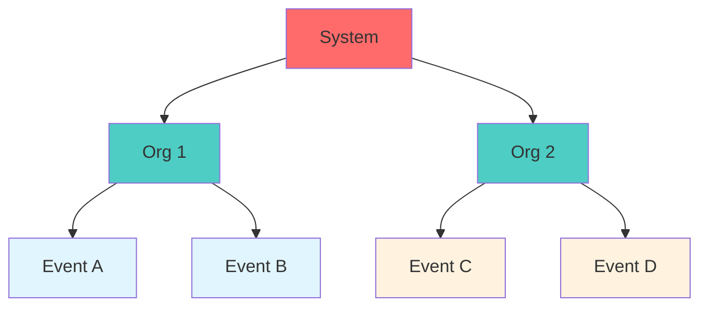

# Security Overview

Conducky is designed with security as a foundational principle. This section provides comprehensive information about how Conducky protects your data, manages access, and ensures the confidentiality of sensitive incident reports.

## 🔒 Security Principles

### Data Protection First
- **Event isolation**: All incident data is strictly scoped to individual events
- **Role-based access**: Users only see information they're authorized to view
- **Encryption at rest**: Sensitive data is encrypted in the database
- **Secure authentication**: Multiple authentication methods with proper session management

### Privacy by Design
- **Internal/external comments**: Sensitive discussions can be kept private to response teams
- **Anonymous reporting**: Option for completely anonymous incident submission
- **Data minimization**: Only necessary information is collected and stored
- **Related file protection**: Uploaded files are access-controlled and securely stored

### Audit and Accountability
- **Comprehensive logging**: All significant actions are logged for audit purposes
- **Role tracking**: Changes to user permissions are recorded
- **Activity monitoring**: System-wide activity tracking for security analysis
- **Data integrity**: Database-level constraints ensure data consistency

## 🏗️ Security Architecture

### Multi-Tenant Security Model

### Access Control Layers

1. **Authentication Layer**: Verify user identity
2. **Authorization Layer**: Check user permissions
3. **Data Scope Layer**: Ensure event-specific data access
4. **Audit Layer**: Log all access attempts and actions

## 🔐 Key Security Features

### Authentication & Authorization
- **[Authentication system](./authentication.md)** with multiple methods (password, OAuth)
- **[Role-based access control (RBAC)](./access-control/overview)** with inheritance
- **Session management** with secure cookies
- **Social login** integration (Google, GitHub) with security controls

### Data Protection
- **Database encryption** for sensitive fields
- **File upload security** with type validation and virus scanning
- **Input validation** and sanitization
- **SQL injection protection** through parameterized queries

### Incident Security
- **Report confidentiality** controls
- **Related file protection** with access controls
- **Comment visibility** management (public vs internal)
- **Authenticated reporting** with data encryption

### System Security
- **Audit logging** of all significant actions
- **Rate limiting** to prevent abuse
- **Security headers** (CSP, HSTS, etc.)
- **Deployment security** best practices

## 🚨 Quick Security Reference

### For Users
- **Incident privacy**: Your reports are only visible to authorized response team members
- **Data retention**: Understand how long your data is kept and your right to deletion
- **Account security**: Use strong passwords and enable two-factor authentication when available

### For Event Administrators
- **Team access**: Carefully manage who has access to incident reports
- **Role assignments**: Follow principle of least privilege when assigning roles
- **Data handling**: Ensure compliance with your organization's data protection policies

### For System Administrators
- **Security monitoring**: Regular review of audit logs and security events
- **Access management**: Implement proper controls for system-level access
- **Incident response**: Have procedures in place for security incidents

## 📊 Security Standards

### Security Implementation
- **Industry best practices** for web application security
- **Data protection** with encryption at rest
- **Access controls** with role-based permissions
- **Audit logging** for accountability

### Security Measures
- **Input validation** and sanitization
- **SQL injection protection** through parameterized queries
- **Rate limiting** to prevent abuse
- **Security headers** (CSP, HSTS, etc.)

## 🔍 Security Monitoring

<!-- Screenshot Placeholder -->
> **Screenshot needed**: Security dashboard showing system health metrics

### What We Monitor
- **Failed login attempts** and suspicious activity
- **Permission changes** and role modifications
- **Data access patterns** and unusual behavior
- **System resource usage** and performance

### Security Alerts
- **Real-time monitoring** of critical security events
- **Automated responses** to common threats
- **Administrative notifications** for security incidents
- **Audit trail preservation** for investigations

## 📞 Security Support

### Reporting Security Issues
- **Email**: security@conducky.com
- **Responsible disclosure**: We follow industry-standard disclosure practices
- **GitHub Issues**: Report security issues through our GitHub repository

### Getting Help
- **Security questions**: Contact your system administrator
- **Data privacy concerns**: Reach out to your organization's data protection officer
- **Incident response**: Follow your organization's incident response procedures

## 📚 Related Documentation

### Deep Dive Topics
- **[Authentication & Authorization](./authentication.md)** - Detailed login and permission system
- **[Access Control](./access-control/overview)** - RBAC system and role management
- **Data Protection** - Encryption, storage, and privacy controls (coming soon)
- **Incident Security** - Report and related file protection (coming soon)
- **Audit Logging** - Activity tracking and compliance (coming soon)
- **Deployment Security** - Production security configuration (coming soon)

### Implementation Guides
- **[Admin Guide: Security Configuration](../admin-guide/security-overview.md)** - System setup
- **Security Architecture** - Technical implementation (coming soon)
- **[User Guide: Data Security](../user-guide/data-security.md)** - User perspective on privacy

## Key Security Areas

- **Authentication**: Secure user login and session management
- **Access Control**: Role-based permissions for all actions
- **Data Protection**: Encryption of sensitive data at rest and in transit
- **Incident Security**: Protection for incident reports and comments
- **Related File Protection**: Secure storage and access for uploaded files
- **Audit Logging**: Comprehensive logging of all system activities

This document provides an overview of the security measures in place. For more detailed information, please refer to the specific security pages. 