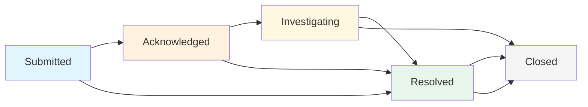

# Code of Conduct Team Guide

This guide is for event responders, event administrators, and Code of Conduct team members who handle incident reports. Learn how to effectively manage incidents, coordinate with your team, and ensure proper resolution.

## 🎯 Overview: Your Role as a Response Team Member

As a member of the response team, you have access to powerful tools for incident management:

- **View and manage all incident reports** for your events
- **Track incident status** through the complete lifecycle
- **Assign incidents** to specific team members
- **Collaborate with internal comments** invisible to reporters
- **Manage related files** and coordinate investigations
- **Generate reports** and maintain audit trails

Your role is critical in maintaining safe, inclusive event environments.

## 📊 Incident Dashboard: Your Command Center

### Accessing the Incident Dashboard

Navigate to your event's incident dashboard at:
- `/events/[event-name]/incidents`
- Or click "Incidents" in the event navigation menu

<!-- Screenshot Placeholder -->
> **Screenshot needed**: Incident dashboard for responders showing the incident queue view

### Dashboard Features

**Incident Queue View**
- See all incidents at a glance with status, priority, and assignment
- Filter by status, priority, assignee, or date range
- Sort by creation date, last updated, or priority level
- Search across incident titles and descriptions

**Quick Stats**
- **Needs Response**: Incidents in "submitted", "acknowledged", or "investigating" status
- **Assigned to You**: Incidents specifically assigned to your user account
- **Total Active**: All open incidents requiring attention
- **Recently Resolved**: Completed incidents for reference

**Bulk Actions**
- Select multiple incidents for batch operations
- Bulk assign incidents to team members
- Bulk status changes (e.g., acknowledge multiple reports)
- Bulk priority adjustments

## 🔄 Incident Lifecycle and Status Management

### Understanding Incident States

#### **Submitted** (Initial State)
- **What it means**: New incident report awaiting initial review
- **Your action**: Review and acknowledge within 24 hours
- **Next steps**: Move to "Acknowledged" or directly to "Investigating" if action is needed

#### **Acknowledged** 
- **What it means**: Report has been reviewed and confirmed as valid
- **Your action**: Plan investigation approach and assign if needed
- **Next steps**: Begin investigation or assign to appropriate team member

#### **Investigating**
- **What it means**: Active investigation is underway
- **Your action**: Gather information, interview parties, coordinate response
- **Requirements**: Must be assigned to a specific responder
- **Next steps**: Move to "Resolved" when appropriate action has been taken

#### **Resolved**
- **What it means**: Incident has been addressed and resolution documented
- **Your action**: Document outcome and any follow-up actions
- **Requirements**: Resolution notes are required
- **Next steps**: Monitor for any additional issues, then close

#### **Closed**
- **What it means**: Incident is completely finished with no further action needed
- **Your action**: Archive and move to long-term storage
- **Next steps**: No further action unless new information emerges

<!-- Screenshot Placeholder -->
> **Screenshot needed**: Incident status management interface showing workflow stages

### Changing Incident Status

**Required Information by Status:**

| Status | Assignment Required | Notes Required | Additional Requirements |
|--------|-------------------|----------------|------------------------|
| Acknowledged | No | No | Initial review completed |
| Investigating | **Yes** | **Yes** | Must assign to responder |
| Resolved | No | **Yes** | Document resolution steps |
| Closed | No | No | Final archival |

**Status Change Process:**
1. Open the incident detail page
2. Click on the current status or use the "Change Status" button
3. Select the new status from available transitions
4. Fill in required fields (assignment, notes)
5. Click "Confirm Transition"

## 👥 Assignment and Team Collaboration

### Assigning Incidents

**Who Can Be Assigned:**
- Event Responders
- Event Administrators  
- System Administrators

**Assignment Best Practices:**
- Assign based on expertise and availability
- Consider workload distribution across team
- Assign complex cases to experienced responders
- Use unassigned status for general team review

**Assignment Process:**
1. From incident list: Click the assignment dropdown
2. From incident detail: Use the assignment section
3. During status change: Assign while moving to "Investigating"
4. Bulk assignment: Select multiple incidents and assign to one person

<!-- Screenshot Placeholder -->
> **Screenshot needed**: Response team collaboration interface showing team assignment

### Team Communication

**Internal Comments**
- Only visible to response team members
- Use for investigation coordination and sensitive discussions
- Perfect for sharing related file analysis or planning next steps
- Can include markdown formatting for structured information

**Comment Best Practices:**
- Be clear and professional in all communications
- Document important decisions and reasoning
- Use @mentions to notify specific team members
- Include timestamps for important actions or discoveries

## 🔍 Filtering and Finding Incidents

### Advanced Filtering Options

**By Status:**
- View only incidents needing immediate attention
- Filter resolved incidents for reference
- Show closed incidents for historical analysis

**By Assignment:**
- "My Incidents": Show only incidents assigned to you
- "Unassigned": Find incidents needing assignment
- "Team Member": Filter by specific responder

**By Priority/Severity:**
- Critical: Immediate safety concerns
- High: Urgent issues requiring prompt action
- Medium: Important but not emergency
- Low: General concerns with flexible timeline

**By Date Range:**
- Recent incidents (last 24 hours, week, month)
- Custom date ranges for specific periods
- Filter by incident date vs. report submission date

<!-- Screenshot Placeholder -->
> **Screenshot needed**: Incident filtering and search interface

### Search Functionality

**Search Across:**
- Incident titles and descriptions
- Reporter names (for authorized users)
- Location information
- Involved parties
- Comment content (internal and public)

**Search Tips:**
- Use quotes for exact phrase matches
- Search supports partial word matching
- Filter first, then search for better results
- Save common search combinations as bookmarks

## 💬 Comment System Deep Dive

### Comment Visibility Levels

**Public Comments:**
- Visible to reporter and all response team members
- Used for updates the reporter should see
- Appropriate for general status updates and non-sensitive questions
- Reporter can reply and interact

**Internal Comments:**
- Only visible to responders and event administrators
- Perfect for team coordination and sensitive information
- Use for investigation planning and related file discussion
- Include decision-making rationale and next steps

<!-- Screenshot Placeholder -->
> **Screenshot needed**: Comment system interface showing internal vs external comments

### Comment Threading and Organization

**Reply Structure:**
- Comments support threading for organized discussions
- Use replies to respond to specific points or questions
- Quote previous comments for context when helpful

**Comment Formatting:**
- Full markdown support for formatting
- Use headers, lists, and emphasis for clarity
- Include links to external resources or documentation
- Code blocks for technical information

**Notification System:**
- Team members get notified of new comments
- Configure notification preferences in your profile
- Email notifications available for important updates

## 📁 Related File Management

### Viewing and Managing Related Files

**File Types**:
- Screenshots and photos
- Documents (PDFs, Word files, etc.)  
- Audio and video recordings
- Chat logs and email screenshots

**File Security**:
- All files are stored securely.
- Only authorized team members can view related files.

### Accessing Related Files

**File Analysis**:
- View files in the incident detail view.
- Download files for offline analysis.
- Add comments about file significance.

### Adding Additional Files

Response team members can add files during investigation:

- Click "Add Related File" in the incident detail view.
- Select files from your device.
- Add description of file source and relevance.
- Files are immediately available to team.

### Best Practices

1. **Describe Everything**:
- Add descriptions to all files.
- Explain why the file is relevant.
2. **File Organization**:
- Use a consistent naming scheme for files.
- Link files to specific aspects of investigation.

---

## 📈 Reporting and Analytics

### Incident Dashboard

- **Overview**: Get a high-level view of all incidents.
- **Filtering**: Filter incidents by status, priority, etc.
- **Search**: Search for specific incidents.

### Key Metrics

- **Response Time**: Track how quickly your team responds.
- **Resolution Time**: See how long it takes to resolve incidents.
- **Incident Volume**: Monitor the number of incidents over time.

### Use Cases

- **Identify Trends**: Spot patterns in incident types.
- **Resource Planning**: Allocate resources based on incident volume.
- **Process Improvement**: Find bottlenecks in your response process.

## 🛠️ Advanced Features

### Bulk Actions

- **Assign Multiple Incidents**: Assign several incidents to a single responder.
- **Change Status**: Update the status of multiple incidents at once.

### Use Cases

- **Triage**: Quickly assign new incidents.
- **Closing Out**: Close multiple resolved incidents.

### Custom Tags

- **Categorization**: Create custom tags for your event.
- **Filtering**: Filter incidents by custom tags.

### Best Practices

- **Standardize Tags**: Use a consistent set of tags.
- **Color-Coding**: Use colors to visually distinguish tags.

## 🔒 Security Best Practices

- **Use Strong Passwords**: Protect your account with a strong password.
- **Enable 2FA**: Add an extra layer of security with two-factor authentication.
- **Be Mindful of PII**: Avoid sharing personally identifiable information in public comments.
- Document related files thoroughly with descriptions.

---

*This guide provides a starting point. Adapt these practices to your team's specific needs.* 