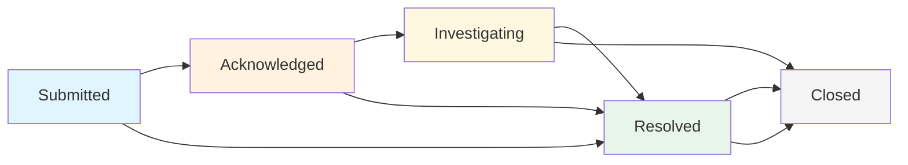

# Code of Conduct Team Guide

This guide is for event responders, event administrators, and Code of Conduct team members who handle incident reports. Learn how to effectively manage incidents, coordinate with your team, and ensure proper resolution.

## 🎯 Overview: Your Role as a Response Team Member

As a member of the response team, you have access to powerful tools for incident management:

- **View and manage all incident reports** for your events
- **Track incident status** through the complete lifecycle
- **Assign incidents** to specific team members
- **Collaborate with internal comments** invisible to reporters
- **Manage evidence** and coordinate investigations
- **Generate reports** and maintain audit trails

Your role is critical in maintaining safe, inclusive event environments.

## 📊 Incident Dashboard: Your Command Center

### Accessing the Incident Dashboard

Navigate to your event's incident dashboard at:
- `/events/[event-name]/incidents`
- Or click "Incidents" in the event navigation menu

<!-- Screenshot Placeholder -->
> **Screenshot needed**: Incident dashboard for responders showing the incident queue view

### Dashboard Features

**Incident Queue View**
- See all incidents at a glance with status, priority, and assignment
- Filter by status, priority, assignee, or date range
- Sort by creation date, last updated, or priority level
- Search across incident titles and descriptions

**Quick Stats**
- **Needs Response**: Incidents in "submitted", "acknowledged", or "investigating" status
- **Assigned to You**: Incidents specifically assigned to your user account
- **Total Active**: All open incidents requiring attention
- **Recently Resolved**: Completed incidents for reference

**Bulk Actions**
- Select multiple incidents for batch operations
- Bulk assign incidents to team members
- Bulk status changes (e.g., acknowledge multiple reports)
- Bulk priority adjustments

## 🔄 Incident Lifecycle and Status Management

### Understanding Incident States

#### **Submitted** (Initial State)
- **What it means**: New incident report awaiting initial review
- **Your action**: Review and acknowledge within 24 hours
- **Next steps**: Move to "Acknowledged" or directly to "Investigating" if action is needed

#### **Acknowledged** 
- **What it means**: Report has been reviewed and confirmed as valid
- **Your action**: Plan investigation approach and assign if needed
- **Next steps**: Begin investigation or assign to appropriate team member

#### **Investigating**
- **What it means**: Active investigation is underway
- **Your action**: Gather information, interview parties, coordinate response
- **Requirements**: Must be assigned to a specific responder
- **Next steps**: Move to "Resolved" when appropriate action has been taken

#### **Resolved**
- **What it means**: Incident has been addressed and resolution documented
- **Your action**: Document outcome and any follow-up actions
- **Requirements**: Resolution notes are required
- **Next steps**: Monitor for any additional issues, then close

#### **Closed**
- **What it means**: Incident is completely finished with no further action needed
- **Your action**: Archive and move to long-term storage
- **Next steps**: No further action unless new information emerges

<!-- Screenshot Placeholder -->
> **Screenshot needed**: Incident status management interface showing workflow stages

### Changing Incident Status

**Required Information by Status:**

| Status | Assignment Required | Notes Required | Additional Requirements |
|--------|-------------------|----------------|------------------------|
| Acknowledged | No | No | Initial review completed |
| Investigating | **Yes** | **Yes** | Must assign to responder |
| Resolved | No | **Yes** | Document resolution steps |
| Closed | No | No | Final archival |

**Status Change Process:**
1. Open the incident detail page
2. Click on the current status or use the "Change Status" button
3. Select the new status from available transitions
4. Fill in required fields (assignment, notes)
5. Click "Confirm Transition"

## 👥 Assignment and Team Collaboration

### Assigning Incidents

**Who Can Be Assigned:**
- Event Responders
- Event Administrators  
- System Administrators

**Assignment Best Practices:**
- Assign based on expertise and availability
- Consider workload distribution across team
- Assign complex cases to experienced responders
- Use unassigned status for general team review

**Assignment Process:**
1. From incident list: Click the assignment dropdown
2. From incident detail: Use the assignment section
3. During status change: Assign while moving to "Investigating"
4. Bulk assignment: Select multiple incidents and assign to one person

<!-- Screenshot Placeholder -->
> **Screenshot needed**: Response team collaboration interface showing team assignment

### Team Communication

**Internal Comments**
- Only visible to response team members
- Use for investigation coordination and sensitive discussions
- Perfect for sharing evidence analysis or planning next steps
- Can include markdown formatting for structured information

**Comment Best Practices:**
- Be clear and professional in all communications
- Document important decisions and reasoning
- Use @mentions to notify specific team members
- Include timestamps for important actions or discoveries

## 🔍 Filtering and Finding Incidents

### Advanced Filtering Options

**By Status:**
- View only incidents needing immediate attention
- Filter resolved incidents for reference
- Show closed incidents for historical analysis

**By Assignment:**
- "My Incidents": Show only incidents assigned to you
- "Unassigned": Find incidents needing assignment
- "Team Member": Filter by specific responder

**By Priority/Severity:**
- Critical: Immediate safety concerns
- High: Urgent issues requiring prompt action
- Medium: Important but not emergency
- Low: General concerns with flexible timeline

**By Date Range:**
- Recent incidents (last 24 hours, week, month)
- Custom date ranges for specific periods
- Filter by incident date vs. report submission date

<!-- Screenshot Placeholder -->
> **Screenshot needed**: Incident filtering and search interface

### Search Functionality

**Search Across:**
- Incident titles and descriptions
- Reporter names (for authorized users)
- Location information
- Involved parties
- Comment content (internal and public)

**Search Tips:**
- Use quotes for exact phrase matches
- Search supports partial word matching
- Filter first, then search for better results
- Save common search combinations as bookmarks

## 💬 Comment System Deep Dive

### Comment Visibility Levels

**Public Comments:**
- Visible to reporter and all response team members
- Used for updates the reporter should see
- Appropriate for general status updates and non-sensitive questions
- Reporter can reply and interact

**Internal Comments:**
- Only visible to responders and event administrators
- Perfect for team coordination and sensitive information
- Use for investigation planning and evidence discussion
- Include decision-making rationale and next steps

<!-- Screenshot Placeholder -->
> **Screenshot needed**: Comment system interface showing internal vs external comments

### Comment Threading and Organization

**Reply Structure:**
- Comments support threading for organized discussions
- Use replies to respond to specific points or questions
- Quote previous comments for context when helpful

**Comment Formatting:**
- Full markdown support for formatting
- Use headers, lists, and emphasis for clarity
- Include links to external resources or documentation
- Code blocks for technical information

**Notification System:**
- Team members get notified of new comments
- Configure notification preferences in your profile
- Email notifications available for important updates

## 📁 Evidence Management

### Viewing and Managing Evidence

**Evidence Types:**
- Screenshots and photos
- Documents (PDFs, Word files, etc.)  
- Audio and video recordings
- Chat logs and email screenshots

**Evidence Security:**
- All files are encrypted and access-controlled
- Only authorized team members can view evidence
- Download tracking for audit purposes
- Secure deletion when incident is closed

**Evidence Analysis:**
- View files directly in the incident interface
- Download for detailed analysis when needed
- Add comments about evidence significance
- Share findings through internal comments

### Adding Additional Evidence

Response team members can add evidence during investigation:

1. **Upload Process:**
   - Click "Add Evidence" in the incident detail view
   - Drag and drop or select files to upload
   - Add description of evidence source and relevance
   - Evidence is immediately available to team

2. **Evidence Organization:**
   - Files are organized by upload date
   - Add descriptive filenames and notes
   - Link evidence to specific aspects of investigation
   - Maintain chain of custody documentation

## 📈 Reporting and Analytics

### Individual Incident Reports

Generate comprehensive incident reports including:
- Complete timeline of events and actions
- All comments and communications
- Evidence inventory and analysis
- Resolution details and follow-up actions
- Involved parties and contact information

### Team Performance Analytics

**Available Metrics:**
- Average response time by team member
- Incident resolution times by category
- Team workload distribution
- Trending issues and patterns

**Dashboard Analytics:**
- Active incidents by status and priority
- Team member assignment overview
- Recent activity and upcoming deadlines
- Month-over-month incident trends

## ⚙️ Advanced Features

### Bulk Operations

**Bulk Status Changes:**
1. Select multiple incidents using checkboxes
2. Choose "Bulk Actions" → "Change Status"
3. Select new status and provide notes
4. Confirm changes for all selected incidents

**Bulk Assignment:**
1. Select incidents needing assignment
2. Choose "Bulk Actions" → "Assign To"
3. Select team member from dropdown
4. All selected incidents are assigned simultaneously

### Custom Workflows

**Priority Escalation:**
- Set automatic escalation rules for high-priority incidents
- Configure notification chains for urgent issues
- Define response time requirements by incident type

**Status Automation:**
- Configure automatic acknowledgment for certain incident types
- Set up notifications for status changes
- Create reminders for incidents approaching deadlines

## 🚨 Best Practices for Response Teams

### Immediate Response Protocol

**First 24 Hours:**
1. **Acknowledge** all new incidents within 24 hours
2. **Assess urgency** and escalate if immediate safety concerns exist
3. **Assign** high-priority incidents to appropriate responders
4. **Initial contact** with reporter if clarification needed

### Investigation Guidelines

**Documentation Standards:**
- Record all actions taken in internal comments
- Document evidence thoroughly with descriptions
- Maintain professional tone in all communications
- Include timestamps for all significant actions

**Communication Protocol:**
- Keep reporters informed of general progress
- Be transparent about timelines when possible
- Respect confidentiality of all parties involved
- Use professional, empathetic language

### Resolution and Follow-up

**Resolution Documentation:**
- Clearly describe actions taken to address the incident
- Document any ongoing monitoring or follow-up required
- Include lessons learned for future incident prevention
- Ensure all stakeholders are informed of resolution

**Post-Resolution:**
- Monitor for any additional related incidents
- Follow up with reporter on satisfaction with resolution
- Update event policies or procedures if needed
- Share insights with broader response team

## 🔗 Related Resources

- **[Incident Reporting Guide](./incident-reporting)** - How reporters submit incidents
- **Comment Workflows** - Detailed communication guide (coming soon)
- **[Security Documentation](../security/overview)** - Data protection and access controls
- **[Admin Guide](../admin-guide/intro)** - Event management and configuration

---

*This guide helps ensure consistent, professional incident management across all events. Remember that your role in maintaining safe spaces is crucial to event success and participant well-being.* 