# Comment Workflows

Conducky's comment system enables structured communication between incident reporters, response teams, and stakeholders while maintaining appropriate privacy controls.

## Overview

The comment system provides two distinct visibility levels:
- **Internal Comments**: Visible only to response team members and event administrators
- **External Comments**: Visible to the incident reporter and response team

This dual-comment system ensures sensitive team discussions remain private while keeping reporters informed of progress and resolutions.

> **📱 Mobile-First Design**: The comment system is optimized for mobile devices, as many response team members need to communicate while on-the-go during events.

## Comment Visibility Types

### Internal Comments
**Purpose**: Team coordination, sensitive discussions, investigation notes
**Visibility**: Response team members and event administrators only
**Use Cases**:
- Coordinating response strategies
- Discussing evidence and witness accounts
- Planning follow-up actions
- Recording investigative notes
- Team member assignments and task coordination

### External Comments
**Purpose**: Communication with incident reporters
**Visibility**: Incident reporter, response team members, and event administrators
**Use Cases**:
- Status updates to the reporter
- Requesting additional information
- Explaining next steps in the process
- Providing resolution details
- Scheduling follow-up meetings

## Comment Interface

### Adding Comments

```mermaid
flowchart TD
    A[📱 Open Incident Page] --> B[💬 Navigate to Comments Section]
    B --> C{Choose Comment Type}
    
    C -->|🔒 Internal Comment| D[Internal Comment Editor<br/>• Visible to response team only<br/>• Used for investigation notes]
    C -->|🌐 External Comment| E[External Comment Editor<br/>• Visible to reporter<br/>• Used for updates & communication]
    
    D --> F[✍️ Compose Message]
    E --> F
    
    F --> G{Add Attachments?}
    G -->|📎 Yes| H[Upload Files<br/>• Images, documents<br/>• Evidence materials]
    G -->|✅ No| I[Review & Submit]
    
    H --> I
    I --> J[✅ Comment Posted]
    
    J --> K[📧 Notifications Sent]
    K --> L[👥 Team members notified<br/>📱 Reporter updated if external]
    
    style A fill:#e1f5fe
    style C fill:#fff3e0
    style D fill:#f3e5f5
    style E fill:#e8f5e8
    style J fill:#e8f5e8
```

**Comment Creation Process**:
1. Navigate to the incident detail page
2. Scroll to the comments section
3. Choose comment type (Internal/External toggle)
4. Write your message using the rich text editor
5. Optionally attach files or images
6. Submit the comment

### Comment Threading
Comments support threaded conversations to maintain context:
- **Reply to Comments**: Click "Reply" on any comment to create a threaded response
- **Thread Visibility**: Replies inherit the visibility of the parent comment
- **Thread Collapse**: Long threads can be collapsed for easier navigation

## Notification System

### Automatic Notifications
The system automatically sends notifications when:
- New comments are added to incidents you're involved in
- Someone replies to your comment
- Your team is mentioned in a comment
- External comments are posted (notifies the reporter)

### Notification Preferences
Users can customize their notification settings:
- **Email Notifications**: Immediate email alerts for new comments
- **In-App Notifications**: Browser/mobile app notifications
- **Daily Digest**: Summary of comment activity
- **Team Mentions**: Special alerts when @mentioned

### @Mentions and Team Communication
Use @mentions to notify specific team members:
- `@username` - Notify a specific user
- `@response-team` - Notify all response team members
- `@event-admins` - Notify event administrators

## Comment Management

### Editing and Deletion
- **Edit Window**: Comments can be edited within 30 minutes of posting
- **Edit History**: All edits are tracked for audit purposes
- **Deletion**: Only comment authors and event admins can delete comments
- **Soft Delete**: Deleted comments are marked as deleted but preserved for audit trails

### Comment Moderation
Event administrators have additional moderation capabilities:
- **Hide Comments**: Temporarily hide inappropriate comments
- **Lock Threads**: Prevent further replies to resolved discussions
- **Pin Comments**: Highlight important updates at the top of the comment list

## Team Collaboration Features

### Comment Status Tracking
- **Unread Indicators**: New comments are marked with unread badges
- **Read Receipts**: See who has read important comments
- **Comment Counts**: Quick view of total comments per incident

### Bulk Comment Operations
For response teams managing multiple incidents:
- **Mark All Read**: Clear unread indicators across incidents
- **Filter by Type**: View only internal or external comments
- **Search Comments**: Find specific discussions across all incidents

### Team Handoffs
When transferring incident ownership:
- **Handoff Comments**: Special comment type for documenting transfers
- **Context Preservation**: New assignees can see full comment history
- **Notification Chains**: Automatic updates to relevant team members

## Mobile Comment Workflows

### Quick Response Templates
Pre-configured responses for common situations:
- "We've received your report and are investigating"
- "We need additional information to proceed"
- "This incident has been resolved"
- "We're scheduling a follow-up meeting"

### Voice-to-Text Comments
For mobile users in busy environments:
- Voice dictation support for quick comment entry
- Automatic transcription with edit capability
- Hands-free operation for active response scenarios

### Offline Comment Drafts
- Comments can be drafted offline
- Auto-sync when connection is restored
- Draft preservation across app sessions

## Comment Security and Privacy

### Data Protection
- All comments are encrypted in transit and at rest
- Comment content is included in regular security audits
- Access logging tracks who reads sensitive internal comments

### Privacy Controls
- Internal comments never appear in any external communications
- Comment visibility cannot be changed after posting (prevents accidental exposure)
- Reporters cannot see internal comment counts or indicators

### Audit Trail
Complete audit logging includes:
- Comment creation, editing, and deletion events
- Visibility changes and access patterns
- File attachments and downloads
- @mention notifications and responses

## Best Practices

### For Response Teams

**Internal Comment Guidelines**:
- Use internal comments for sensitive discussions
- Document investigation steps and findings
- Coordinate team assignments and responsibilities
- Record decisions and rationale

**External Comment Guidelines**:
- Keep reporters informed of progress
- Use clear, professional language
- Provide specific next steps when possible
- Respond within established timeframes

### For Event Administrators

**Comment Oversight**:
- Monitor comment quality and appropriateness
- Ensure timely responses to reporter questions
- Review internal discussions for completeness
- Maintain professional standards in all communications

**Team Coordination**:
- Use @mentions for urgent situations
- Pin important updates for visibility
- Archive resolved discussions to reduce clutter
- Train team members on comment best practices

## Troubleshooting

### Common Issues

**Comments Not Appearing**:
- Check your notification settings
- Verify you have the correct permissions for the incident
- Refresh the page to sync latest comments

**Notification Problems**:
- Confirm email address is verified
- Check spam/junk folders for comment notifications
- Update browser notification permissions

**Mobile Display Issues**:
- Update the mobile app to the latest version
- Clear browser cache for web-based access
- Check internet connection for comment sync

### Getting Help

For comment system issues:
1. Check the [Troubleshooting Guide](./troubleshooting.md)
2. Contact your event administrators
3. Submit a support request through the help system

> **💡 Pro Tip**: Use the comment system's search functionality to quickly find previous discussions about similar incidents, helping maintain consistency in your response approach.

## Screenshots Needed

The following screenshots would enhance this documentation:

1. **Comment interface overview** - Split view showing internal vs external comment sections
2. **Comment type selector** - Toggle interface for choosing comment visibility  
3. **Threaded conversation** - Example of reply chains and threading
4. **@mention functionality** - Showing team member mentions and notifications
5. **Mobile comment interface** - Optimized mobile view for quick responses
6. **Comment moderation panel** - Admin controls for managing comments
7. **Notification settings** - User preferences for comment alerts
8. **Comment search interface** - Finding specific discussions across incidents 