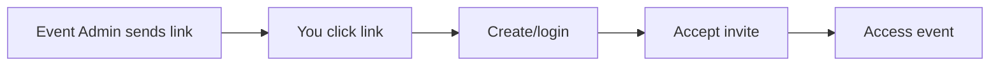

# Account Setup

Learn how to create your Conducky account and manage authentication through different methods.

---

## Creating an Account

New users can create an account in several ways depending on how your organization uses Conducky:

### Direct Registration (First User)

Visit `/register` to create a new account when setting up a new Conducky instance:

1. **Navigate** to your organization's Conducky URL + `/register`
2. **Enter** your email address, full name, and password
3. **Password requirements**: 8+ characters, mix of letters, numbers, symbols
4. **Automatic elevation**: The first user to register becomes a System Admin automatically
5. **Next steps**: Subsequent users need invitations to access functionality

:::tip First User Benefits
As the first user, you become a System Admin with full system access. You can create events, manage system settings, and invite other users.
:::

**Screenshot needed:** *Registration form showing email, name, and password fields with requirements*

### Invitation Links (Most Common)

Most users join through event invitations sent by administrators:

1. **Click** the invitation link sent by an event administrator
2. **Create account** or log in if you already have one
3. **Accept invitation** to join the event with the specified role
4. **Automatic redirect** to the event dashboard

**Example invitation workflow:**

**Screenshot needed:** *Invitation acceptance page showing event details and role assignment*

### Invite Codes (Alternative Method)

Some organizations provide codes you can redeem yourself:

1. **Get the code** from your event administrator
2. **Log in** to your Conducky account
3. **Go to** `/profile/events`
4. **Enter code** in the "Join Event" section
5. **Confirm** your participation

**Screenshot needed:** *Profile events page showing invite code redemption form*

---

## Password Management

### Forgot Password

If you can't remember your password:

1. **Visit** the login page
2. **Click** "Forgot Password" link
3. **Enter** your email address
4. **Check email** for reset link
5. **Follow link** to `/reset-password`
6. **Create** new password

**Screenshot needed:** *Forgot password form and reset password page*

### Change Password

Update your password anytime from your profile:

1. **Navigate** to Profile Settings (accessible from the user menu)
2. **Find** "Change Password" section
3. **Enter** current password and new password
4. **Click** "Update Password"

**Screenshot needed:** *Profile settings page showing password change form*

---

## Security Best Practices

:::warning Security Best Practices
- Use a unique, strong password
- Don't share your account credentials
- Log out when using shared computers
- Report any suspicious activity to administrators
:::

### Strong Password Guidelines

**Requirements:**
- Minimum 8 characters
- Mix of uppercase and lowercase letters
- Include numbers and symbols
- Avoid common words or personal information

**Recommendations:**
- Use a password manager
- Consider passphrases (e.g., "Coffee!Mountain#2024")
- Update passwords periodically
- Never reuse passwords from other sites

### Account Security

**Protecting your account:**
- Log out completely when finished
- Don't save passwords on shared computers
- Be cautious with public Wi-Fi
- Report suspicious login attempts

**If your account is compromised:**
1. Change your password immediately
2. Contact your system administrator
3. Review recent activity in audit logs
4. Update any saved passwords

---

## Multi-Event Account Management

### Understanding Multi-Event Access

One Conducky account can participate in multiple events with different roles:

- **Same account**: Use one login for all your events
- **Different roles**: You might be a Reporter in one event, Admin in another
- **Separate contexts**: Activities in one event don't affect others
- **Unified profile**: Same name and avatar across all events

### Managing Event Memberships

**From your profile** (`/profile/events`):
- View all events you belong to
- See your role in each event
- Use invite codes to join new events
- Leave events you no longer need access to

**Benefits of multi-event accounts:**
- **Single login**: No need to remember multiple passwords
- **Consistent identity**: Same name and avatar everywhere
- **Cross-event features**: Unified notifications and reporting
- **Easy switching**: Navigate between events seamlessly

---

## Troubleshooting Account Issues

### Can't Log In

**Check these common issues:**

1. **Correct URL**: Make sure you're on the right Conducky instance
2. **Email address**: Use the exact email you registered with
3. **Password**: Try resetting if you're unsure
4. **Account status**: Your account might be disabled - contact administrators
5. **Browser issues**: Clear cache or try incognito mode

### Can't See Any Events

**This usually means:**
- You haven't been invited to any events yet
- Your invitations haven't been accepted
- Your event roles were removed
- The events you belonged to were disabled

**Solutions:**
- Contact event administrators for invitations
- Check your email for invitation links
- Ask system administrators about account status

### Invitation Links Not Working

**Common problems:**
- Link has expired (check with sender for new link)
- Link was already used (if single-use)
- You're logged in as a different user
- Browser blocking the redirect

**Solutions:**
- Try the link in incognito mode
- Log out and try again
- Request a new invitation link
- Contact the person who sent the invitation

---

## Next Steps

After creating your account:

1. **[Complete your profile](./profile-management)** - Add your information and preferences
2. **[Learn about your dashboard](./first-steps)** - Understand what you see after login
3. **[Understand your role](./understanding-roles)** - Know your permissions and responsibilities

**Need immediate help?** Check our [FAQ](../faq/overview) or [Troubleshooting Guide](../troubleshooting).

---

**Continue with:** [First Steps →](./first-steps) 