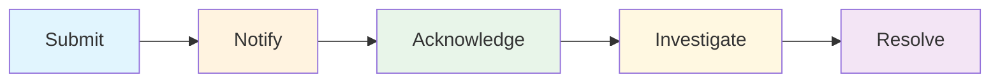

# Incident Reporting Guide

This guide covers everything you need to know about submitting incident reports in Conducky. Incident reporting is the primary function most users will perform, so we've made it as simple and secure as possible.

## 🚀 Quick Start: Submit Your First Report

### Getting to the Report Form

There are several ways to submit an incident report:

#### 1. **From the Global Dashboard**
- Navigate to your dashboard
- Look for the prominent "Submit Report" section
- Click the button for your event (or select from dropdown if you're in multiple events)

#### 2. **From an Event Dashboard**
- Go to your event's main page
- Click the "Submit Report" button in the Quick Actions section

#### 3. **Direct Link**
- Navigate directly to `/events/[event-name]/incidents/new`

#### 4. **Keyboard Shortcut**
- Press `Ctrl+Shift+R` (or `Cmd+Shift+R` on Mac) from anywhere in the app
- This works for single-event users or opens a selector for multi-event users

<!-- Screenshot Placeholder -->
> **Screenshot needed**: Mobile incident reporting form showing the clean, accessible interface

## 📝 The Incident Reporting Process

### Step 1: Basic Information

**Incident Title** (Required)
- Provide a concise summary in 10-70 characters
- Think of this as a subject line that helps responders quickly understand the issue
- Examples: "Harassment during keynote", "Unsafe booth behavior", "Code of conduct violation"

**Incident Description** (Required)
- Describe what happened in as much or as little detail as you're comfortable sharing
- Include relevant context like when, where, and who was involved
- You can use markdown formatting if needed
- No character limit - share what feels right for you

### Step 2: Context Details (All Optional)

**Date and Time of Incident**
- When did this happen? Can be approximate
- Helps responders understand timeline and context
- Cannot be more than 24 hours in the future (to prevent accidental future dates)

**Location**
- Where did this occur? (up to 200 characters)
- Can be as specific or general as you prefer
- Examples: "Main conference hall", "Registration desk", "Sponsor booth area"

**Involved Parties**
- Who was involved? (up to 500 characters)
- You can use names, descriptions, or whatever level of detail you're comfortable with
- This helps responders understand the scope and identify relevant people

### Step 3: Evidence and Attachments

You can optionally upload supporting evidence:

**Supported File Types:**
- Screenshots and photos
- Documents (PDF, Word, etc.)
- Audio/video files
- Chat logs or email screenshots

**How to Upload:**
- Drag and drop files onto the upload area
- Click "Choose Files" to browse your device
- Multiple files can be uploaded
- Files are stored securely and only accessible to authorized response team members

<!-- Screenshot Placeholder -->
> **Screenshot needed**: Incident submission confirmation screen showing the next steps

### Step 4: Urgency Setting (Response Team Only)

If you're a responder or event admin, you'll see an additional "Urgency Level" field:
- **Low**: Non-urgent issues that can be addressed during normal hours
- **Medium**: Issues that should be addressed soon but aren't emergencies
- **High**: Urgent issues requiring prompt attention
- **Critical**: Immediate safety concerns requiring immediate response

Regular reporters don't see this field - the response team will assess urgency when they review your report.

## 🔒 Privacy and Security

### Authenticated Reporting
- All reports require you to be logged in with a verified account
- Your identity is only visible to authorized response team members
- Reports are never made public with identifying information
- Data is encrypted at rest for additional security

### Who Can See Your Report?
1. **You** - The person who submitted it
2. **Event Response Team** - Responders and event administrators
3. **Assigned Responder** - If your report gets assigned to someone specific
4. **System Administrators** - For technical support only

### Data Protection
- All sensitive report data is encrypted in the database
- Evidence files are stored securely with access controls
- Reports are never shared between different events
- You have the right to request deletion of your data

## 📱 Mobile-First Design

Conducky is designed with mobile users in mind, since most incident reporting happens on mobile devices.

### Mobile Features:
- **Touch-optimized interface** - Easy to use on phones and tablets
- **Simplified navigation** - Quick access to report submission
- **Offline draft saving** - Your report is saved as you type
- **File upload from camera** - Take photos directly or upload from gallery
- **Voice-to-text support** - Use your device's voice input for descriptions

### Mobile Tips:
- Use the device's back button to navigate safely without losing your draft
- Tap and hold text fields to access copy/paste options
- Use the device's camera to capture evidence directly
- Reports can be submitted on any screen size

## 🔄 After You Submit

### What Happens Next?

1. **Immediate Confirmation**
   - You'll see a success message with your report ID
   - An email confirmation is sent (if email notifications are enabled)
   - You're redirected to view your submitted reports

2. **Acknowledgment** (Within 24 hours)
   - The response team acknowledges your report
   - You may receive initial questions or clarifications
   - The report status changes to "Acknowledged"

3. **Investigation** (Timeline varies)
   - A responder may be assigned to your case
   - You might be contacted for additional information
   - Evidence is reviewed and appropriate actions are planned

4. **Resolution**
   - You'll be informed of the outcome (when appropriate)
   - Report status changes to "Resolved" or "Closed"
   - Follow-up actions may be implemented

### Tracking Your Reports

You can view and track all your submitted reports:

- **My Incidents Page**: `/events/[event-name]/my-incidents`
- **Global Dashboard**: Shows reports across all your events
- **Status Updates**: Get notified when your report status changes
- **Comment Notifications**: Receive alerts when responders add updates

## 💬 Communication During Investigation

### How Comments Work

The response team may add comments to your report during the investigation:

**Public Comments**
- Visible to you and the response team
- Used for general updates and non-sensitive communication
- You can reply and ask questions

**Internal Comments**
- Only visible to response team members
- Used for sensitive discussions or coordination
- You won't see these comments

### Adding Your Own Comments

You can add comments to your reports to:
- Provide additional information
- Answer questions from responders
- Share new evidence or updates
- Ask about the status or timeline

<!-- Screenshot Placeholder -->
> **Screenshot needed**: Comment system interface showing public vs internal comments

## ⚠️ Important Guidelines

### What to Report
- Harassment (verbal, physical, or online)
- Discrimination based on protected characteristics  
- Code of conduct violations
- Safety concerns or unsafe behavior
- Inappropriate comments or conduct
- Any behavior that makes you or others feel unsafe

### What NOT to Include
- Don't include unverified rumors or speculation
- Avoid naming uninvolved parties
- Don't share private communications without consent
- Don't include irrelevant personal details

### Emergency Situations
- **Immediate physical danger**: Call local emergency services first
- **Ongoing safety threats**: Contact event security immediately
- **After safety is ensured**: Submit a report for documentation and follow-up

## 🆘 Getting Help

### If You Need Assistance
- **Event Contact**: Each event has specific contact information
- **Technical Issues**: Contact the system administrators
- **General Questions**: Check the [FAQ](./faq/overview) section

### Before You Submit
- Review our [Quick Start Guide](./quick-start) if this is your first time
- Check if similar issues have guidance in the [FAQ](./faq/overview)
- Consider whether this needs immediate attention vs. formal reporting

### After Submission
- Save your report ID for reference
- Enable notifications to stay updated on progress
- Don't hesitate to add comments if you remember additional details

## 🔗 Related Resources

- **[Quick Start Guide](./quick-start)** - 5-minute introduction to Conducky
- **[Understanding Your Dashboard](./navigation/overview)** - Navigate between events and reports
- **[FAQ](./faq/overview)** - Common questions and answers
- **[Code of Conduct Team Guide](./coc-team-guide)** - How reports are handled (for responders)
- **Comment Workflows** - Detailed guide to communication during investigations (coming soon)

---

*Remember: Your safety and comfort are the top priority. Submit reports when you feel ready, and don't hesitate to seek help if you need support during the process.* 