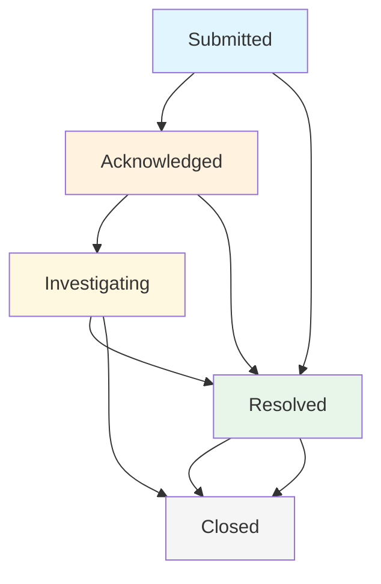

# Incident States and Lifecycle

Understanding incident states is crucial for effective incident management. This guide explains the complete incident lifecycle, status transitions, and what each state means for reporters, response teams, and administrators.

## Incident State Overview

Conducky uses a simple, effective state system to track incidents from initial submission through final closure. Each state represents a specific phase in the incident management process and determines what actions are available to different user types.

## The Five Incident States

### Submitted
**Description**: Incident has been submitted but not yet reviewed by the response team.
**Duration**: Typically 0-24 hours (depending on event response time commitments)
**Visible to**: Reporter, Response Team, Event Administrators

**What happens in this state**:
- Incident appears in response team queue
- Initial notification sent to response team
- System performs initial validation
- Awaiting team acknowledgment

**Available actions**:
- **Response Team**: Move to "Acknowledged" or directly to "Investigating"
- **Reporter**: Add additional information via comments
- **Event Admins**: Assign to specific responders, add internal comments

### Acknowledged
**Description**: Response team has confirmed receipt and is planning their approach.
**Duration**: Typically 24-72 hours for initial assessment
**Visible to**: Reporter, Response Team, Event Administrators

**What happens in this state**:
- Response team has reviewed the incident
- Initial assessment is conducted
- Investigation plan is being developed
- Team coordination is underway

**Available actions**:
- **Response Team**: 
  - Move to "Investigating" to begin active work
  - Move directly to "Resolved" if no investigation needed
  - Assign specific team members
  - Add internal comments for coordination
- **Reporter**: Provide additional information via comments

### Investigating
**Description**: Active investigation and response actions are underway.
**Duration**: Variable, depending on incident complexity (hours to weeks)
**Visible to**: Reporter, Response Team, Event Administrators

**What happens in this state**:
- Active investigation is conducted
- Evidence is gathered and analyzed
- Interviews may be conducted with relevant parties
- Progress updates are provided to the reporter
- **Requirement**: Must be assigned to a specific responder

**Available actions**:
- **Response Team**:
  - Update investigation status via internal comments
  - Provide progress updates to reporter via external comments
  - Move to "Resolved" when investigation is complete
  - Move directly to "Closed" if appropriate
- **Reporter**: Provide additional information as requested

### Resolved
**Description**: Investigation is complete and appropriate actions have been taken.
**Duration**: Brief transition state before closure
**Visible to**: Reporter, Response Team, Event Administrators

**What happens in this state**:
- Investigation findings are documented
- Resolution details are communicated to reporter
- Any follow-up actions are scheduled
- Case is prepared for closure
- **Requirement**: Resolution notes must be documented

**Available actions**:
- **Response Team**: 
  - Provide final resolution details to reporter
  - Document lessons learned
  - Move to "Closed" when complete
- **Reporter**: Review resolution and provide feedback

### Closed
**Description**: Incident is fully resolved and closed to further action.
**Duration**: Permanent state
**Visible to**: Response Team, Event Administrators (limited visibility to reporter)

**What happens in this state**:
- No further action is required
- Complete case documentation is finalized
- Incident data is preserved for reference
- Reporter access is limited to final resolution summary

**Available actions**:
- **Event Administrators**: Reopen if new information emerges
- **System**: Maintain for audit and reporting purposes

## State Transition Rules

### Automatic Transitions
The system does not perform automatic state transitions. All state changes must be made manually by authorized team members.

### Manual Transitions
Response team members and administrators can transition states based on investigation needs:

**From Submitted**:
- → Acknowledged (standard workflow)
- → Investigating (if immediate action needed)
- → Resolved (for simple issues requiring no investigation)

**From Acknowledged**:
- → Investigating (begin active work)
- → Resolved (for issues not requiring investigation)

**From Investigating**:
- → Resolved (investigation complete)
- → Closed (direct closure if appropriate)

**From Resolved**:
- → Closed (standard completion)

**Special Transitions**:
- Any active state → Closed (for immediate closure when appropriate)

## State-Specific Requirements

### Assignment Requirements
- **Investigating**: Must be assigned to a specific responder
- **Other states**: Assignment is optional but recommended

### Documentation Requirements
- **Investigating**: Requires notes explaining the transition
- **Resolved**: Requires resolution documentation
- **Other states**: Notes are optional but encouraged

## State-Specific Permissions

### Reporter Permissions by State
- **Submitted, Acknowledged, Investigating**: Can add comments and provide information
- **Resolved**: Can view resolution details and provide feedback
- **Closed**: Read-only access to final resolution summary

### Response Team Permissions by State
- **All active states (Submitted through Resolved)**: Full access to comments, state changes, and investigation tools
- **Closed**: Read-only access for reference

### Administrator Permissions by State
- **All states**: Full access to all incident data and state management
- **Special actions**: Can reopen closed incidents if necessary

## Best Practices for State Management

### For Response Teams

**State Transition Guidelines**:
- Move to "Acknowledged" promptly to confirm receipt
- Use "Investigating" for active work requiring assignment
- Document resolution clearly before moving to "Resolved"
- Close incidents only when completely finished

**Documentation Standards**:
- Add notes when changing to "Investigating" or "Resolved"
- Use internal comments for team coordination
- Use external comments for reporter communication
- Document decisions and rationale

### For Event Administrators

**Oversight Responsibilities**:
- Monitor incidents stuck in early states
- Ensure proper assignment for investigating incidents
- Review resolution quality before closure
- Handle any necessary reopening of closed incidents

**Team Coordination**:
- Assign incidents based on team expertise
- Monitor workload distribution
- Ensure timely state progression
- Maintain documentation standards

## Troubleshooting State Issues

### Common Problems

**Incidents Stuck in Submitted**:
- Check team notification settings
- Verify responder availability
- Consider direct assignment

**Unable to Move to Investigating**:
- Ensure incident is assigned to a responder
- Verify user has appropriate permissions
- Check that notes are provided

**Cannot Mark as Resolved**:
- Confirm resolution documentation is complete
- Verify user has responder or admin role
- Check that all required fields are filled

### Getting Help

For state management issues:
1. Check user permissions and roles
2. Verify all required fields are completed
3. Contact event administrators for assistance
4. Review the [troubleshooting guide](./troubleshooting.md) for common solutions

> **💡 Pro Tip**: Use internal comments to document your reasoning when changing states - this helps maintain clear audit trails and assists other team members in understanding the incident progression.

## Screenshots Needed

The following screenshots would enhance this documentation:

1. **State transition interface** - Showing the dropdown for changing incident states
2. **State requirements dialog** - Assignment and notes requirements for different states  
3. **Incident timeline view** - Visual representation of state changes over time
4. **State-based filtering** - Filtering incidents by current state
5. **Assignment interface** - Assigning responders when moving to investigating state
6. **Resolution documentation** - Required fields when marking incidents as resolved 